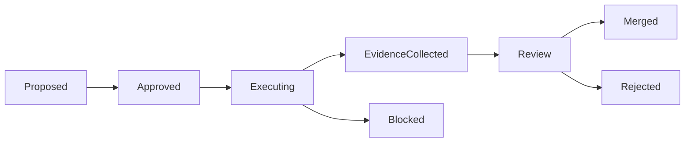

# Agent Task Envelope

The Agent Task Envelope is the canonical record for AI-assisted engineering work. It defines the objective, risk tier, permitted context, allowed tools, execution constraints, evidence, and review requirements before an agent acts.

The envelope is intentionally boring. It should be easy to diff, review, archive, and replay.

## Why This Exists

AI delivery needs a stable unit of governance. Prompts are too informal, chat history is too implicit, and PR descriptions arrive too late. The task envelope sits before execution and becomes the contract for the work.

Use it as the equivalent of:

- a change request
- a Terraform plan
- a build manifest
- a lightweight audit record

## Required Properties

Every envelope MUST include:

- task id
- objective
- owner
- risk tier
- repositories or bounded workspaces
- allowed tools
- prohibited actions
- evidence expectations
- review requirements

## Risk Tiers

| Tier | Meaning | Typical Review |
| --- | --- | --- |
| T1 | Documentation or non-runtime metadata | Lightweight review or auto-merge |
| T2 | Localized code change with test coverage | Human review |
| T3 | Cross-cutting runtime, data, or workflow change | Human review plus operational evidence |
| T4 | Security, auth, infra, secrets, CI/CD, production data | Explicit approval gate and security review |

## Minimal Envelope

```yaml
task:
  id: T-0001
  title: Fix Android login crash
  objective: Resolve crash during token refresh without changing auth semantics.
  owner: rj

classification:
  type: bugfix
  risk_tier: T2

context:
  repositories:
    - mobile-app
  references:
    - issue: APP-1234

constraints:
  allowed:
    - inspect existing login flow
    - modify localized crash handling
    - add regression tests
  prohibited:
    - changing token lifetime
    - changing OAuth scopes
    - editing CI workflows

execution:
  tools:
    - repo_read
    - shell_tests
    - github_pr
  actions:
    - inspect
    - patch
    - test
    - summarize

evidence:
  required_level: E2
  tests:
    - unit
    - regression
  artifacts:
    - test output
    - PR diff

review:
  required: true
  approvers:
    - code_owner
  notes: Auth-adjacent but not auth-policy-changing.

status: proposed
```

## Governance Rules

Agents MUST NOT expand scope silently. A task requiring a broader workspace, stronger tool, higher risk tier, or weaker evidence must be reclassified before execution continues.

Agents MUST treat the envelope as binding input, not advisory context.

Reviewers SHOULD reject work when the PR does not map back to the envelope objective, constraints, and evidence expectations.

## State Model



## Integration Points

The envelope can be used by:

- PR templates
- approval engines
- CI policy checks
- MCP/Hermes tool gates
- audit logs
- incident reviews

## Design Bias

Prefer explicit limits over clever automation. The envelope should make unsafe expansion visible before it becomes an execution problem.
