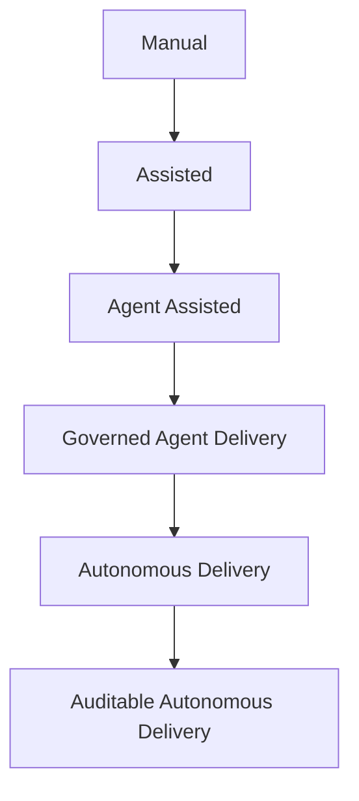

# AI Delivery Maturity Model

This maturity model describes how organizations move from informal AI assistance to governed, auditable AI delivery.

The target for this playbook is Level 3: Governed Agent Delivery.

## Level 0: Manual Delivery

AI is not used in engineering delivery.

### Characteristics

- human-only implementation
- human-only review
- conventional CI/CD
- no agent governance needed

### Failure Mode

Slow delivery, but conventional accountability is clear.

## Level 1: Assisted Delivery

AI suggests code, explanations, or snippets, but humans drive execution.

### Characteristics

- Copilot-style completion
- chat-assisted debugging
- no autonomous tool use
- evidence still produced by humans

### Required Controls

- normal code review
- normal test evidence
- no special agent approval required

### Failure Mode

Generated code enters the codebase without enough skepticism.

## Level 2: Agent-Assisted Delivery

Agents perform bounded tasks with tools, but humans still guide and review most work.

### Characteristics

- agents inspect repositories
- agents edit files
- agents run local tests
- agents draft PRs

### Required Controls

- task envelope
- risk tiering
- allowed tool list
- PR evidence report

### Failure Mode

Agent scope expands silently, especially through shell, CI, dependencies, or stale context.

## Level 3: Governed Agent Delivery

Agent work is explicitly bounded, risk-tiered, evidenced, and reviewed.

### Characteristics

- task envelopes are standard
- tool use is policy-bound
- evidence is required by risk tier
- sensitive changes require approval gates
- attack catalog informs review

### Required Controls

- envelope schema
- delivery evidence standard
- tool decision records
- sensitive path policy
- security review for T4 work

### Failure Mode

Governance becomes documentation-only unless enforced by CI, templates, or approval systems.

## Level 4: Autonomous Delivery

Agents perform larger delivery loops with limited human interruption.

### Characteristics

- agents plan and execute multi-step changes
- policy gates block high-risk actions
- humans review exceptions and sensitive changes
- rollback is pre-modeled

### Required Controls

- automated risk classification
- tool-call audit logs
- policy-as-code
- environment isolation
- rollback validation

### Failure Mode

The organization mistakes automation for autonomy and loses operational clarity.

## Level 5: Auditable Autonomous Delivery

Autonomous delivery is backed by complete provenance, replayability, and independent verification.

### Characteristics

- signed artifacts
- traceable context inputs
- replayable execution records
- verifiable approval chains
- independent evidence checks

### Required Controls

- provenance capture
- cryptographic signing
- reproducible builds where practical
- tamper-evident audit logs
- independent security validation

### Failure Mode

High control-plane complexity becomes its own operational risk.

## Practical Adoption Path

## Recommended Milestones

1. Define the task envelope.
2. Require evidence reports on AI-assisted PRs.
3. Classify sensitive paths as minimum T4.
4. Add attack catalog review prompts.
5. Enforce policy in CI or approval tooling.
6. Capture tool call decision records.
7. Add provenance and replayability for autonomous workflows.

## Positioning

This project should not compete with agent frameworks. It should define how agent-created work becomes safe, reviewable, and operationally acceptable.
