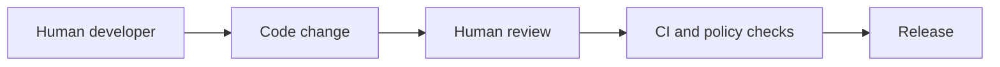
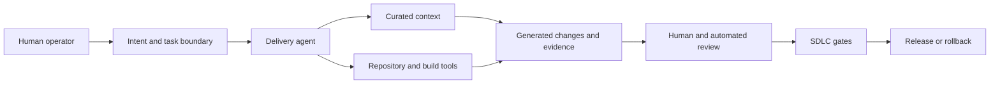

# AI-Native SDLC Governance

Traditional SDLC assumes humans author changes, tools execute deterministic checks, and reviewers evaluate a bounded diff. AI-native delivery changes that model. Agents can plan work, assemble context, modify files, run tools, open pull requests, and produce review evidence.

This document defines the additional SDLC concern introduced when AI agents become delivery participants.

## Core concern

AI-native SDLC governance answers:

> How do we preserve accountability, reviewability, provenance, and delivery safety when non-human actors participate in software delivery?

This is not only an AI tooling concern. It is a software supply-chain concern.

Agent-assisted delivery creates new artifacts that need governance:

- Prompts
- Task contracts
- Planning notes
- Context bundles
- Tool invocations
- Generated code
- Generated tests
- Review evidence
- Model and agent metadata
- Human approval records

If those artifacts are not controlled, the organization creates a shadow SDLC beside the existing one.

## Traditional delivery model

The dominant control assumptions are:

- The human author understands the intent.
- The diff is the primary artifact.
- Reviewers evaluate implementation and risk.
- CI validates known technical controls.
- Deployment authority is separated by branch protection, release gates, or change approval.

## Agentic delivery model

The new control problem is that the diff no longer tells the full story. Reviewers also need to understand:

- Why the agent made the change
- What context it used
- Which tools it invoked
- Whether it stayed within scope
- Whether the evidence is real and reproducible
- Which human accepted accountability for the change

## Required control points

### 1. Intent

Every meaningful agent task should start with a bounded intent.

Minimum fields:

- Goal
- Non-goals
- Allowed files or systems
- Disallowed files or systems
- Risk tier
- Review owner
- Required evidence

Use `examples/agent-task-contract.md` for medium and high-risk work.

### 2. Context

Context is part of the trusted computing base for agent-assisted delivery.

Teams should define:

- Which repository files were provided
- Which logs, issues, tickets, or external references were used
- Whether generated or retrieved context was stale
- Whether context came from trusted or untrusted sources
- Whether MCP/tool responses could influence code generation

Failure mode: an agent modifies production behavior based on stale docs, poisoned issue comments, fabricated tool output, or unrelated legacy code.

### 3. Identity and authority

Agents, humans, tools, and platforms should have distinct identities.

Avoid collapsing these into one broad token or shared workstation identity.

Recommended separation:

| Actor | Typical authority |
| --- | --- |
| Human operator | Defines intent, reviews, approves |
| Delivery agent | Proposes, edits, tests, explains |
| Tool runtime | Executes bounded commands |
| CI system | Validates and records evidence |
| Release system | Deploys through existing gates |

Agents should not self-approve their own work or hold production deployment authority.

### 4. Tool access

Agent tool access should be explicit and revocable.

Default posture:

- Read-only repository access before task approval
- Scoped write access after task approval
- No production secrets
- No cloud admin credentials
- No mobile signing keys
- Network disabled unless needed
- Dependency installation controlled by lockfiles

For sensitive tasks, require command allowlists and human approval before write or deployment operations.

### 5. Evidence

Agent evidence must be verifiable. A statement like "tests pass" is not sufficient unless it includes the actual command, environment, and result.

Expected evidence includes:

- Files changed
- Commands run
- Test results
- Static analysis results where relevant
- Security impact
- Scope exceptions
- Known risks
- Rollback path

Use `docs/delivery-evidence-standard.md` as the standard evidence shape.

### 6. Review and approval

Reviewers should treat agent output as untrusted generated code.

Review must verify:

- Scope stayed bounded
- Tests are meaningful
- Generated code follows local architecture
- Security invariants were preserved
- Dependency changes are intentional
- No secrets or sensitive data were exposed
- Rollback is realistic

Medium and high-risk work requires a human owner. Critical or restricted work remains human-led, with agents limited to planning, documentation, or checklist generation.

### 7. Audit and provenance

The organization should be able to answer:

- Who requested the task?
- What was the approved scope?
- Which agent or model produced the change?
- What context was provided?
- What tools were invoked?
- What evidence was produced?
- Who reviewed and approved the result?
- How can the change be rolled back?

This does not require heavyweight bureaucracy for every task. The evidence depth should scale with `docs/task-risk-matrix.md`.

## Governance requirements by risk tier

| Tier | Governance expectation |
| --- | --- |
| 0: Informational | Cite inspected files or sources; no writes |
| 1: Low | Normal review; basic evidence if files changed |
| 2: Medium | Task contract; scoped write access; CI evidence; human review |
| 3: High | Explicit approval; security/platform review; rollback plan; stronger evidence |
| 4: Restricted | Human-led execution; agent may assist with plans or docs only |

## AI-native SDLC failure modes

| Failure mode | Example | Control |
| --- | --- | --- |
| Shadow SDLC | Agent modifies code through side channels with no task record | Require task contracts and PR evidence |
| Context poisoning | Agent follows malicious issue comment or MCP response | Treat untrusted context explicitly; review context sources |
| Approval collapse | Same identity generates, approves, and deploys | Separate agent, human, CI, and release authority |
| Fabricated evidence | Agent claims tests passed without running them | Require command output or CI links |
| Scope creep | Agent changes unrelated modules | Allowed/disallowed paths and diff review |
| Secret exposure | Token pasted into prompt or logs | No production secrets in agent runtime |
| Supply-chain drift | Agent updates lockfiles or actions silently | Dependency and workflow diff review |
| Irreversible change | Agent executes migration or deletion | Human-led execution for restricted tasks |

## Good enough vs production-grade

Good enough for experimentation:

- Human prompts agent with a small task
- Agent opens a diff
- Human reviews and runs local tests

Production-grade for durable teams:

- Task risk classification
- Written task contracts for meaningful work
- Scoped identity and permissions
- Preserved evidence
- CI-backed validation
- Human accountability for merge and release
- Audit trail for agent-assisted changes

## Relationship to existing docs

Use this document with:

- `docs/secure-coding-agent-workflow.md` for the end-to-end loop
- `docs/task-risk-matrix.md` for risk classification
- `docs/threat-model.md` for adversarial thinking
- `docs/delivery-evidence-standard.md` for PR and workflow evidence
- `docs/trust-model.md` for identity and authority boundaries
