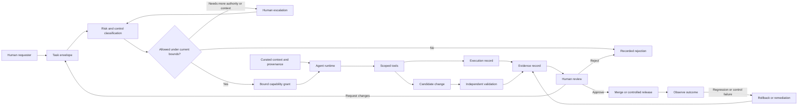

# Canonical Architecture

This document defines the canonical architecture of the agent-delivery playbook: its primitives, artifact relationships, trust boundaries, lifecycle, and limits.

The playbook is a standalone governance reference. It provides portable policy, schemas, templates, examples, and validation tooling. It does not provide an agent runtime, identity provider, authorization service, CI platform, evidence store, merge service, or release system.

## Architectural invariant

Agent-assisted delivery remains safe only when intent, authority, execution, evidence, and approval are independently visible and bounded.

```text
intent != authority
execution != evidence
validation != approval
generation != release
```

An agent may prepare or execute work within granted bounds. It does not acquire authority merely because it can call a tool, produce a patch, or report success.

## System context



The diagram is logical rather than product-specific. Each adopting repository decides which existing systems implement the boxes and where manual review remains appropriate.

## Canonical primitives

### Task envelope

The task envelope is the bounded statement of intended work. It records:

- objective and owner;
- risk classification;
- approved context;
- allowed and prohibited actions;
- tools and operations expected during execution;
- required evidence;
- review requirements;
- lifecycle status.

The envelope is a request and governance record. In the current playbook it is **not** a cryptographically bound authorization token and does not itself grant runtime access.

See [`agent-task-envelope.md`](agent-task-envelope.md) and [`task-envelope.schema.json`](../schemas/task-envelope.schema.json).

### Risk tier

The risk tier selects the minimum control posture for the task. It describes potential impact, sensitivity, reversibility, and required review rather than estimating whether an agent is likely to succeed.

Risk classification is a human-accountable policy decision. Validation can check that a tier is present and recognized; it cannot prove the selected tier is semantically correct.

See [`task-risk-matrix.md`](task-risk-matrix.md).

### Capability grant

A capability grant is the effective authority made available for one task or execution window. Conceptually it binds:

- actor or runtime identity;
- repository and ref scope;
- readable and writable resources;
- allowed tools and actions;
- credential scope;
- network scope;
- expiration or revocation conditions;
- task-envelope reference.

The playbook currently documents capability boundaries but does not issue or enforce grants. In a manual adoption, the effective grant may be represented by human-controlled tool selection, repository permissions, sandbox configuration, and short-lived credentials.

See [`trust-model.md`](trust-model.md) and [`agent-capability-catalog.md`](agent-capability-catalog.md).

### Context provenance

Context provenance records what information influenced planning or execution, including:

- approved sources;
- included and summarized material;
- excluded or deferred material;
- stale-context caveats;
- escalation decisions;
- assumptions about model-visible context.

Context is an untrusted supply-chain input. Retrieval success, repository presence, or tool output does not make context authoritative.

See [`context-budget-and-provenance.md`](context-budget-and-provenance.md).

### Execution record

The execution record describes material actions taken by the agent or tool runtime, such as commands, API calls, file modifications, and relevant environment metadata.

The record supports investigation and review but is not automatically trustworthy. Its value increases when it is captured independently, bound to a commit or artifact, and produced by a protected system.

### Evidence

Evidence supports claims about the candidate change. It can include:

- test and build output;
- static-analysis results;
- changed-file and scope summaries;
- artifact hashes;
- CI links;
- reproduction instructions;
- rollback or recovery proof;
- reviewer-observable runtime results.

Evidence must be attributable to the tested change. An agent-authored statement that a test passed is a claim, not independent evidence.

See [`delivery-evidence-standard.md`](delivery-evidence-standard.md) and [`replayable-evidence-envelope.md`](replayable-evidence-envelope.md).

### Review decision

Review is the accountable decision to approve, reject, request changes, or escalate. Review evaluates:

- intent and scope;
- risk classification;
- authority used;
- change correctness;
- evidence sufficiency;
- policy and architectural fit;
- rollback readiness.

Automated checks inform review but do not replace the accountable approval decision.

### Outcome

A governed task has an explicit outcome:

- rejected before execution;
- escalated for context, authority, or specialist review;
- blocked pending evidence or environmental conditions;
- approved and merged;
- approved for controlled release;
- rolled back or remediated after an adverse result.

Rejection and rollback are successful governance outcomes when they prevent or contain unsafe effects.

## Artifact classes and authority

The repository uses five primary artifact classes.

| Artifact class | Purpose | Authority |
| --- | --- | --- |
| Normative policy | Defines required governance behavior and control expectations | Human-readable source of policy intent |
| Schema or policy artifact | Defines machine-checkable structure or configuration | Source of structural validation rules |
| Template | Projects policy into a copyable workflow artifact | Derived; must not silently override policy |
| Guidance | Explains rationale, adoption, and implementation options | Non-normative unless explicitly stated |
| Example | Demonstrates one valid or invalid application | Non-normative and never authoritative by itself |

Artifact lifecycle and drift rules are defined in [`governance-lifecycle.md`](governance-lifecycle.md).

## Sources of truth and projections

There is no single file that is authoritative for every concern. Authority is concern-specific.

| Concern | Source of truth | Derived projections |
| --- | --- | --- |
| Task-envelope meaning | `docs/agent-task-envelope.md` | Templates, quickstarts, examples |
| Task-envelope structure | `schemas/task-envelope.schema.json` | YAML examples and validators |
| Risk classification | `docs/task-risk-matrix.md` | Minimum-control tables, examples, review prompts |
| Evidence requirements | `docs/delivery-evidence-standard.md` | PR templates, evidence examples, checklists |
| Trust and authority | `docs/trust-model.md` | Capability catalogs, tool-call records, adoption guidance |
| Sensitive paths | `docs/policy/sensitive-paths.md` | Review templates and examples |
| Artifact maintenance | `docs/governance-lifecycle.md` | Contributor and PR guidance |

When artifacts disagree:

1. fail closed for execution or merge decisions;
2. prefer the concern-specific normative policy over guidance or examples;
3. prefer the schema for structural validation, but do not infer semantic correctness from schema success;
4. open a governance change to reconcile the drift before presenting the behavior as stable.

An adopting repository may create stricter local policy. Its checked-in policy and protected repository configuration become authoritative for that repository, provided they do not claim conformance to controls they have weakened or omitted.

## Trust and authority boundaries

### Playbook boundary

The playbook owns:

- governance vocabulary and lifecycle;
- portable normative policy;
- schemas and validation behavior;
- reusable templates;
- synthetic examples;
- adoption and review guidance.

It does not own or directly control downstream identities, credentials, repositories, runners, merge permissions, release gates, or production environments.

### Adopting repository boundary

The adopting repository owns:

- local security invariants and architecture constraints;
- protected branches and required checks;
- sensitive-path definitions;
- repository-specific task envelopes;
- copied or adapted templates;
- local compatibility decisions;
- merge and release authorization.

Copied artifacts become local code and must be reviewed and maintained like other repository controls.

### Human boundary

Humans remain accountable for:

- task intent;
- risk and exception decisions;
- authority expansion;
- acceptance of residual risk;
- merge approval;
- release approval;
- incident and rollback decisions.

Human approval should be independent of the agent identity that generated or executed the change.

### Agent runtime boundary

The runtime owns execution mechanics within the authority it has been given. It should not be treated as authoritative for:

- policy interpretation;
- approval;
- evidence sufficiency;
- access expansion;
- release decisions.

The runtime may be mistaken, compromised, prompt-injected, or operating on stale context.

### Tool boundary

Tools expose effects such as reads, writes, commands, API calls, issue updates, or deployments. Possession of a tool capability is not proof that its use is authorized for the current task.

Tool access should be scoped independently from natural-language instructions where practical.

### CI boundary

Protected CI can independently validate a candidate change and produce attributable evidence. CI is trustworthy only to the extent that:

- its workflow and dependencies are protected;
- untrusted changes cannot alter or bypass required checks without stronger review;
- credentials and permissions are least-privilege;
- results are bound to the reviewed commit.

### Reviewer boundary

Reviewers consume the task envelope, diff, execution record, CI results, and evidence. They decide whether the change remains within intent and whether residual risk is acceptable.

### Evidence-store boundary

Evidence may live in CI logs, pull requests, repository artifacts, or another durable system. The architecture requires evidence to be locatable and attributable; it does not mandate a specific storage product.

## Control locations

| Control | Primary location | Current playbook support |
| --- | --- | --- |
| Identity | Repository, CI, runtime, or organization identity system | Guidance only |
| Authorization | Repository permissions, runtime sandbox, scoped credentials, human approval | Guidance and templates; no runtime enforcement |
| Execution | Agent runtime and tool environment | Guidance only |
| Structural validation | Repository validation scripts and CI | Implemented for task-envelope examples and repository integrity |
| Semantic validation | Human review, policy-specific checks | Primarily manual |
| Approval | Human reviewer and protected repository/release controls | Guidance and templates |
| Evidence capture | CI, execution environment, PR, artifact storage | Guidance and examples |
| Merge/release | Existing repository and release systems | Outside playbook runtime scope |
| Rollback | Existing source, deployment, data, or operational mechanisms | Guidance and review requirements |

## Delivery lifecycle

### 1. Request and envelope

A human or workflow proposes a task. The task is converted into a bounded envelope before meaningful write or execution authority is granted.

### 2. Classify and decide

The owner classifies risk, selects required controls, and decides whether the current context and authority are sufficient.

Possible outcomes:

- proceed;
- reject;
- narrow scope;
- request more context;
- require stronger evidence;
- require a specialist or security reviewer;
- reserve execution for a human.

### 3. Grant bounded authority

The adopting environment exposes only the tools, paths, credentials, and network access needed for the approved task.

The current playbook records expected authority but does not verify that the runtime's effective permissions match the envelope.

### 4. Execute and record

The agent plans, modifies, and tests within the approved scope. Material context expansion, tool expansion, or path expansion returns the task to classification or escalation rather than being silently assumed.

### 5. Validate and assemble evidence

Local checks and independent CI evaluate the candidate change. Evidence is associated with the reviewed commit or artifact where practical.

### 6. Review and decide

A human reviewer evaluates the change and evidence. Approval does not follow automatically from green CI.

### 7. Merge, release, or reject

The existing repository and release systems perform controlled promotion. Restricted or high-impact operations remain subject to their normal gates.

### 8. Observe and recover

Post-merge or post-release observation may reveal regressions, policy violations, or incomplete evidence. The task outcome must support rollback, remediation, or incident handling rather than assuming merge is terminal success.

## Governance and CI self-modification

Changes that modify the controls evaluating the same change create a circular trust problem.

Examples include modifications to:

- validation workflows;
- branch-protection expectations;
- schemas or validators;
- risk or evidence policy;
- sensitive-path rules;
- review templates;
- dependency pins used by validation;
- release or signing controls.

Such changes should receive stronger review than an ordinary change and should normally require:

1. explicit classification as governance, CI, infrastructure, or security work;
2. identification of the control being modified;
3. independent review by a maintainer who did not author the change;
4. validation using the previous control version where practical;
5. negative tests or bypass-resistance evidence;
6. migration or compatibility notes;
7. no ability for the pull request to approve or exempt itself.

The repository's current CI validates structure and examples but does not technically enforce independent reviewers or branch-protection policy.

## Adoption stages

### Stage 1: manual governed delivery

The team uses task envelopes, risk classification, constrained tools, evidence expectations, and human review manually.

This stage is useful and supported today. Its assurance depends on team discipline and existing repository controls.

### Stage 2: CI-assisted conformance

The team moves objective checks into CI, such as:

- schema validation;
- sensitive-path detection;
- required evidence fields;
- repository integrity;
- test and build requirements.

This repository currently demonstrates CI-assisted structural validation for its own task-envelope examples and documentation integrity.

### Stage 3: enforceable authorization and attestation

A mature environment may bind task identity, capability grants, execution records, evidence, and approval to protected identities and artifacts.

Potential controls include ephemeral credentials, policy decision points, signed provenance, protected evidence stores, and runtime effect gating.

These are architectural extension points, not capabilities implemented by this repository today.

## Failure, rejection, and rollback

The architecture fails closed when a material control cannot be established.

| Condition | Expected outcome |
| --- | --- |
| Task intent is ambiguous | Block and refine envelope |
| Risk tier is disputed | Escalate to accountable owner |
| Required context is unavailable or stale | Defer, narrow, or document caveat |
| Runtime authority exceeds the task | Revoke or narrow authority before execution |
| Agent expands scope without approval | Stop execution and reclassify |
| Validation is unavailable | Block merge unless an explicit human exception process exists |
| Evidence is missing or unattributable | Reject or request evidence |
| Governance or CI changes cannot be independently evaluated | Block or require out-of-band review |
| Post-merge regression occurs | Roll back or remediate through existing operational controls |
| Rollback is impossible | Increase risk tier and require stronger pre-merge evidence and approval |

Rollback is system-specific. A source-code revert may be insufficient for data migrations, dependency compromise, credential exposure, store releases, or externally visible effects. The task envelope and review must identify the relevant recovery mechanism.

## Current implementation status

| Capability | Status |
| --- | --- |
| Governance model and lifecycle | Documented |
| Risk and evidence policy | Documented |
| Task-envelope JSON Schema | Implemented |
| Lightweight and standards-based example validation | Implemented |
| Repository link/JSON integrity validation | Implemented |
| Portable templates and examples | Available |
| Semantic risk-classification enforcement | Manual |
| Runtime identity and capability binding | Not implemented |
| Tool-effect authorization | Not implemented |
| Independent evidence attestation | Not implemented |
| Protected evidence storage | Not implemented |
| Merge and release enforcement | Delegated to adopting systems |
| Automated rollback | Not implemented |

## Known architectural gaps

The most important current gaps are:

- task envelopes are governance records, not runtime authorization artifacts;
- the repository cannot observe an adopting runtime's effective credentials or tool permissions;
- evidence can be structurally present without being independently trustworthy;
- semantic classification and approval remain human decisions;
- copied templates can drift after adoption;
- governance and CI independence depends on downstream repository protection;
- no conformance profile yet proves that a downstream repository implemented the full control set.

These gaps should remain visible. Documentation, templates, and green validation checks must not be presented as equivalent to runtime enforcement.

## Related documents

- [`trust-model.md`](trust-model.md)
- [`secure-coding-agent-workflow.md`](secure-coding-agent-workflow.md)
- [`agent-task-envelope.md`](agent-task-envelope.md)
- [`task-risk-matrix.md`](task-risk-matrix.md)
- [`delivery-evidence-standard.md`](delivery-evidence-standard.md)
- [`context-budget-and-provenance.md`](context-budget-and-provenance.md)
- [`governance-lifecycle.md`](governance-lifecycle.md)
- [`task-envelope-validation.md`](task-envelope-validation.md)
