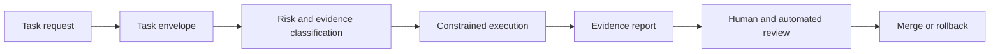

# Documentation Index

Use this index to find the right playbook artifact by intent.

## Lifecycle Map

## Adopt Governed Agent Delivery

| Document | Type | Purpose |
| --- | --- | --- |
| `README.md` | guidance | Project overview and quick adoption path |
| `docs/ai-native-sdlc.md` | guidance | Why AI-native delivery needs extra SDLC controls |
| `docs/secure-coding-agent-workflow.md` | guidance | End-to-end workflow from task to review |
| `docs/ai-delivery-maturity-model.md` | guidance | Maturity path from assisted delivery to auditable autonomy |
| `docs/adoption/governed-agent-delivery-rollout.md` | guidance | Rollout sequence for teams |

## Define and Bound Tasks

| Document | Type | Purpose |
| --- | --- | --- |
| `docs/agent-task-envelope.md` | normative policy | Canonical task envelope model |
| `schemas/task-envelope.schema.json` | normative policy | Machine-readable envelope shape |
| `examples/task-envelope/` | example | Minimal envelope examples by risk tier |
| `examples/agent-task-contract.md` | template | Human-readable task contract |

## Classify Risk and Evidence

| Document | Type | Purpose |
| --- | --- | --- |
| `docs/task-risk-matrix.md` | normative policy | Risk tier definitions and required controls |
| `docs/delivery-evidence-standard.md` | normative policy | Evidence levels and evidence quality rules |
| `docs/policy/minimum-controls.md` | normative policy | Minimum controls by risk tier |
| `docs/policy/sensitive-paths.md` | normative policy | Sensitive path escalation policy |

## Review and Secure Changes

| Document | Type | Purpose |
| --- | --- | --- |
| `docs/reviewer-checklist.md` | guidance | Review checklist for agent-assisted work |
| `docs/threat-model.md` | guidance | Threat model for AI-assisted delivery |
| `docs/security/attack-catalog.md` | guidance | Attack patterns reviewers should consider |
| `docs/trust-model.md` | guidance | Authority, identity, and separation-of-duties model |
| `docs/tool-call-decision-records.md` | normative policy | Records for material tool authority decisions |
| `docs/mobile-agent-safe-checklist.md` | guidance | Mobile/client-specific guardrails |

## Use Templates and Examples

| Path | Type | Purpose |
| --- | --- | --- |
| `.github/PULL_REQUEST_TEMPLATE.md` | template | Active governed PR template |
| `templates/` | template | Reusable controls for target repositories |
| `examples/` | example | Task envelopes and delivery examples |
| `docs/golden-path-examples.md` | guidance | Summary of example flows |

## Reading Paths

- **New adopter:** README -> AI-native SDLC -> workflow -> task risk matrix -> PR template.
- **Reviewer:** reviewer checklist -> evidence standard -> sensitive paths -> attack catalog.
- **Platform/AppSec owner:** minimum controls -> trust model -> tool call decision records -> maturity model.
- **Example-first reader:** golden path examples -> task envelope examples -> evidence report template.
