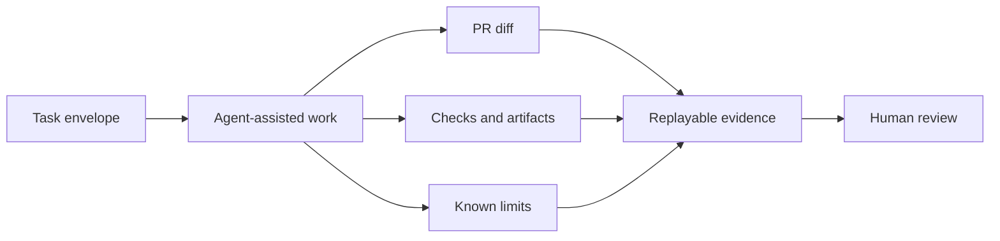

# Replayable Evidence Envelope

A replayable evidence envelope is the audit-oriented record for an agent-assisted PR. It is more specific than a PR summary: it should let a reviewer reconstruct what was authorized, what changed, what was checked, what was not checked, and who approved the result.

## Mental model



The envelope does not make the work deterministic. It makes nondeterminism, missing context, tool limits, and unsupported claims visible.

## Minimum fields

| Field | Purpose |
| --- | --- |
| Task envelope reference | The task contract that authorized the work |
| PR/change reference | The branch, PR, commit, or patch being reviewed |
| Actor/tool identity | Agent, model, tool, workflow, or human identity where known |
| Authority linkage | Tool permissions and approval boundary used for execution |
| Allowed/prohibited scope | Scope actually used compared with the envelope |
| Changed paths | Files or directories changed |
| Commands/checks run | Exact commands, scope, and result |
| CI/artifact links | CI runs, logs, screenshots, reports, or generated artifacts |
| Context/provenance summary | Included, excluded, summarized, deferred, or escalated context |
| Manual verification | Human checks performed outside automation |
| Known nondeterminism | Model variability, generated output, flaky tests, unavailable environment |
| Unverified claims | Claims that were not proven, marked explicitly |
| Rollback path | How to revert, disable, or recover |
| Approval/review linkage | Reviewers, owners, or approvals required before merge |

## Markdown template

```markdown
# Replayable Evidence

## Task Reference

- Envelope:
- Risk tier:
- Required evidence levels:

## Change Reference

- PR:
- Branch/commit:
- Changed paths:

## Execution Identity and Authority

- Agent/tool:
- Human operator:
- Credential class:
- Approval boundary:
- Prohibited actions avoided:

## Context and Provenance

- Included context:
- Summarized context:
- Excluded context and reason:
- Deferred context:
- Escalated context and approval:
- Stale-context caveats:

## Checks and Artifacts

| Check | Command or artifact | Scope | Result |
| --- | --- | --- | --- |
| Static review |  |  |  |
| Tests |  |  |  |
| CI |  |  |  |

## Manual Verification

## Known Limits and Nondeterminism

## Unverified Claims

Unsupported claims must be marked as unverified. Do not hide them by omission.

## Rollback

## Reviewer Notes
```

## Evidence quality rules

- Record what actually happened, not what the agent intended.
- Prefer exact commands, paths, commit SHAs, and CI links over summaries.
- Mark missing checks as missing with a reason.
- Mark unsupported claims as `unverified` instead of deleting them.
- For T3/T4 work, include rollback and independent verification evidence.

## When this is required

| Risk | Expectation |
| --- | --- |
| T1 | PR evidence may be enough when the change is documentation-only and small |
| T2 | Include replay fields for task reference, changed paths, checks, and limits |
| T3 | Include operational evidence, rollback, and context/provenance decisions |
| T4 | Include independent review/approval linkage and explicit authority boundaries |

## Non-goals

This is not an immutable audit log, external evidence store, or runtime trace format. It is a lightweight PR evidence shape that can later be promoted into stronger tooling.