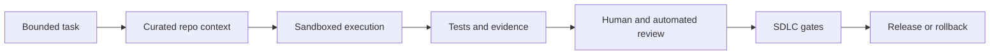

# Secure Coding Agent Workflow

AI coding agents should be handled as delivery participants operating inside a controlled software delivery system. They can propose, edit, test, and explain changes, but they should not silently expand scope, bypass review, hold broad credentials, or become an unlogged side channel for production changes.

## Mental model

A secure workflow is not “ask the agent to fix it.” It is:

The agent is useful when the task boundary is explicit and verification is stronger than the agent's claim about correctness.

## Baseline workflow

### 1. Classify the task

Before running an agent, classify the task using `docs/task-risk-matrix.md`.

Key questions:

- What files, packages, or systems may change?
- Does the task touch auth, crypto, secrets, privacy, payments, release automation, or mobile signing?
- Can correctness be verified with tests or static analysis?
- Is rollback obvious?
- Does the agent need write access, network access, or credentials?

### 2. Write a task contract

Use `examples/agent-task-contract.md` for anything above low risk.

A good task contract includes:

- Goal
- Non-goals
- Allowed files or directories
- Disallowed changes
- Required tests
- Required evidence
- Security invariants
- Review owner
- Rollback plan

### 3. Curate context

Do not dump the whole repository into the prompt unless the task requires it. Prefer targeted context:

- Relevant files
- Architecture notes
- Existing tests
- API contracts
- Security invariants
- Error logs or failing test output

Failure mode: broad context causes the agent to infer architecture that is not real, modify unrelated files, or copy insecure patterns from legacy code.

### 4. Run in a constrained environment

Default controls:

- Read-only repository access until a task is approved
- No production credentials
- No write access to deployment systems
- Network disabled unless explicitly needed
- Temporary workspace or disposable container
- Dependency install controlled by lockfiles
- Logs preserved for review when practical

For high-risk tasks, use a fresh branch, pinned dependencies, explicit command allowlists, and human approval before any write action.

### 5. Require evidence

Agent output should include evidence, not just explanation.

Minimum evidence:

- What changed
- Why it changed
- Commands run
- Test results
- Static analysis results where relevant
- Files intentionally not changed
- Known risks or follow-up work

Strong evidence:

- Before/after failing test
- Reproduction steps
- CI links
- Screenshots for UI changes
- Mobile platform matrix results
- Security scan output
- Manual verification notes

### 6. Review like untrusted code

Review agent output as if it came from a fast but unfamiliar contractor.

Check for:

- Scope expansion
- Hidden dependency changes
- Silent security invariant changes
- Generated code that avoids existing abstractions
- Brittle tests that assert implementation details
- Error handling gaps
- Logging of sensitive data
- Mobile platform regressions
- Build or signing changes

### 7. Apply normal SDLC gates

Agent-authored code should not bypass branch protection, CI, AppSec review, release approvals, or deployment controls.

Recommended gates:

- Formatting/linting
- Unit and integration tests
- Type checks
- Static analysis
- Dependency scanning
- Secret scanning
- License checks
- Mobile build verification where relevant
- Human approval for medium/high-risk changes

### 8. Preserve rollback paths

Every medium/high-risk agent task should identify a rollback strategy before merge.

Examples:

- Revert commit
- Feature flag disablement
- App config rollback
- Dependency pin rollback
- Mobile release phased rollout halt
- Server-side kill switch

## Credential handling

Agents should receive the narrowest credential set that can complete the task.

Prefer:

- Read-only source access
- Short-lived tokens
- Scoped test credentials
- Environment-specific credentials
- No access to production secrets
- No access to signing keys unless the task explicitly requires release engineering work and has human approval

Avoid:

- Personal long-lived tokens
- Production database credentials
- Cloud admin credentials
- Mobile signing material in agent-accessible shells
- Copying secrets into prompts, logs, or issue comments

## Mobile/client considerations

Mobile repositories add failure modes that backend-only workflows often miss:

- Platform-specific build systems hide security-sensitive behavior
- Signing/provisioning material is high value
- Runtime permissions and entitlements can change privacy posture
- Dependency upgrades can affect native code, transitive SDKs, and store review behavior
- React Native and KMP changes may compile on one platform but fail on another

For mobile/client changes, require explicit platform scope:

- React Native: JavaScript/TypeScript only, native modules, Metro/Babel config, Gradle, CocoaPods, or Expo config
- iOS: Swift/Objective-C, entitlements, Info.plist, keychain, networking, App Transport Security, privacy manifests, provisioning
- Android: Kotlin/Java, manifest permissions, Gradle, ProGuard/R8, network security config, keystore, Play Integrity, background work
- Kotlin Multiplatform: shared source sets, expect/actual boundaries, native interop, platform-specific persistence and networking

## Practical defaults

| Task type | Default agent access | Review level |
| --- | --- | --- |
| Documentation from existing code | Read repo, write docs | Normal review |
| Test scaffolding | Read repo, write tests | Normal review |
| Bug fix in one module | Scoped write access | Human review + tests |
| Dependency update | Scoped write access, network as needed | Human review + dependency scan |
| Auth/security/privacy change | Branch only, no prod secrets | Security review required |
| Release/signing/CI credentials | Human-led | Agent may assist with docs/plans only |

## Definition of done

An agent-assisted change is not done until:

- The task stayed within scope
- Required tests passed or failures are explained
- Security invariants were preserved
- Reviewer can understand the change without trusting the agent
- Rollback path is documented for meaningful risk
- CI and normal delivery gates passed
