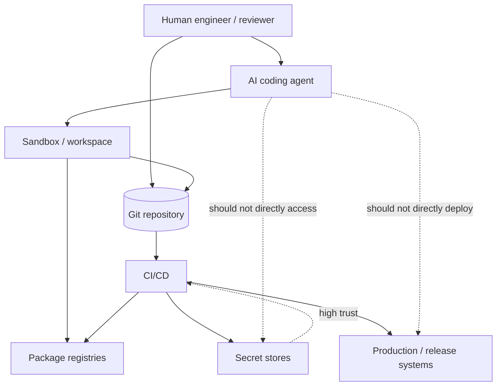

# Threat Model: AI-Assisted Software Delivery

This threat model covers coding agents used to inspect, modify, test, or propose changes to software repositories.

It assumes agents are capable but unreliable delivery participants. They may misunderstand intent, overreach scope, expose sensitive data, introduce vulnerable code, or produce convincing but false evidence.

## Scope

In scope:

- Agent access to source code, tests, docs, build scripts, and CI configuration
- Agent-generated code, documentation, test changes, and pull request content
- Agent runtime environments, local shells, containers, IDE integrations, hosted agent platforms, and CI-based agents
- Credentials exposed to agent workflows
- Review, approval, audit, and rollback paths
- Mobile/client-specific risks for React Native, iOS, Android, and Kotlin Multiplatform

Out of scope by default:

- General model training risk
- Vendor-internal model security
- Production incident response outside agent-authored changes
- Fully autonomous production deployment without human approval

## Assets

| Asset | Why it matters |
| --- | --- |
| Source code | Contains product logic, security controls, IP, and internal implementation details |
| Secrets and credentials | Enable access to source, CI, cloud, package registries, signing, stores, and production systems |
| Build and release pipelines | Can ship malicious or broken changes at scale |
| Dependency graph | Supply-chain attack surface |
| Test and security evidence | Reviewers rely on it to decide whether change is safe |
| Audit trail | Required for accountability, incident reconstruction, and compliance |
| Mobile signing material | Enables app distribution and can be difficult to rotate safely |
| Privacy-sensitive client code | Can affect data collection, permissions, entitlements, and compliance posture |

## Trust boundaries

Primary rule: the agent should operate in a lower-trust boundary than humans, CI release gates, secret stores, and production systems.

## Threats and mitigations

### T1: Scope expansion

The agent modifies files outside the intended task boundary.

Mitigations:

- Require task contracts for medium/high-risk work
- Define allowed and disallowed paths
- Review diffs for unrelated changes
- Use branch protection and CODEOWNERS
- Prefer small commits and short-lived branches

### T2: Secret exposure

Secrets are copied into prompts, logs, tests, generated fixtures, or agent-accessible shells.

Mitigations:

- Do not provide production secrets to agents
- Use short-lived scoped test credentials
- Run secret scanning on generated changes
- Redact logs before prompt inclusion
- Keep signing keys and cloud admin credentials outside agent runtimes

### T3: Insecure code generation

The agent introduces insecure defaults, weak validation, unsafe deserialization, broken auth checks, overbroad permissions, or sensitive logging.

Mitigations:

- Maintain `templates/SECURITY_INVARIANTS.md`
- Require security review for sensitive areas
- Run SAST/DAST/dependency checks as appropriate
- Require tests for negative/security cases
- Review for fail-open behavior

### T4: Fabricated or misleading evidence

The agent claims tests passed, omits failures, or writes tests that do not prove the behavior.

Mitigations:

- Require command output or CI links
- Prefer CI-generated evidence over agent summaries
- Review test quality, not only pass/fail
- Treat unverified claims as non-evidence
- Record commands run in task/PR notes

### T5: Supply-chain manipulation

The agent adds, upgrades, or reconfigures dependencies with transitive risk.

Mitigations:

- Require explicit approval for dependency changes
- Keep lockfile diffs visible
- Run dependency and license scans
- Pin versions where appropriate
- Review package provenance and maintainer signals

### T6: Build or release pipeline compromise

The agent changes CI/CD, release scripts, signing, deployment, or package publishing behavior.

Mitigations:

- Treat pipeline changes as high risk
- Require platform/release owner review
- Use environment protections
- Keep release credentials out of agent workspaces
- Require rollback and dry-run evidence

### T7: Mobile signing and store risk

The agent changes signing, entitlements, provisioning, privacy manifests, app permissions, or store-facing metadata.

Mitigations:

- Require mobile owner review
- Protect keystores, provisioning profiles, certificates, and API keys
- Diff manifests, entitlements, privacy manifests, and build config explicitly
- Test on affected platforms
- Use phased rollout and rollback strategy

### T8: Prompt/context data leakage

Sensitive source, customer data, logs, or internal docs are exposed to an external model or tool provider.

Mitigations:

- Classify context before inclusion
- Avoid customer data in prompts
- Use local or enterprise-approved models for sensitive work
- Redact logs and screenshots
- Maintain vendor and data retention policy awareness

### T9: Architectural drift

The agent introduces patterns that conflict with established architecture, ownership, or operational constraints.

Mitigations:

- Provide `templates/ARCHITECTURE.md` as curated context
- Require owner review for cross-boundary changes
- Keep generated code within existing abstractions
- Add ADRs for intentional architecture changes
- Reject opportunistic rewrites hidden inside feature work

### T10: Rollback failure

Agent-authored changes are difficult to revert, partially deployed, or tied to irreversible migrations.

Mitigations:

- Require rollback notes for medium/high-risk work
- Separate schema migrations from behavior changes where practical
- Use feature flags for risky behavior
- Maintain compatibility windows
- Test rollback or disable paths for release-sensitive work

## Risk signals

Escalate review when a task touches:

- Authentication, authorization, session handling, identity, or policy enforcement
- Cryptography, key management, signing, certificates, or attestation
- Secrets, environment variables, CI/CD, deployment, or release automation
- Dependency manifests or lockfiles
- Data deletion, migration, retention, or privacy-sensitive processing
- Mobile permissions, entitlements, native modules, signing, or store configuration
- Logging, analytics, telemetry, or crash reporting
- Code generation, build tooling, or agent instructions themselves

## Abuse cases

| Abuse case | Example | Control |
| --- | --- | --- |
| Agent exfiltrates secrets through logs | Test command prints `.env` values | Secret scanning, redaction, no prod secrets |
| Agent bypasses auth in a bug fix | Adds temporary admin bypass for tests | Security invariants, negative tests, code review |
| Agent hides dependency risk | Adds package to simplify parsing | Dependency approval and scan |
| Agent changes mobile permissions | Adds Android location permission for unrelated feature | Manifest review, mobile checklist |
| Agent fabricates test success | Claims tests passed without running them | CI evidence required |
| Agent edits release pipeline | Changes publish token scope or workflow triggers | Release owner review |

## Minimum control set

For any production repository using coding agents:

- `AGENTS.md` with allowed/disallowed behavior
- Security invariants document
- Task risk classification
- Secret scanning
- Dependency scanning
- Required human review
- CI gates before merge
- Audit trail of agent-assisted tasks
- Rollback expectation for meaningful risk

## Review questions

- What did the agent have access to?
- What did it change?
- What evidence proves the change works?
- What security invariant could have been weakened?
- What credentials were available during execution?
- What would rollback require?
- What would an attacker try to hide in this diff?
