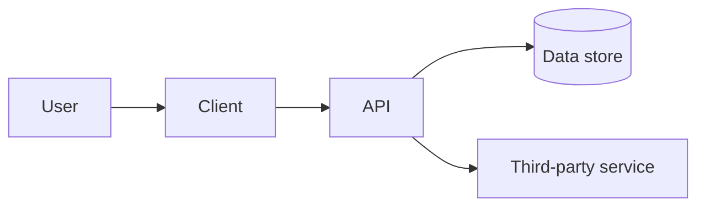

# Architecture Notes

This file gives agents and reviewers the architectural context needed to make safe, local changes without inventing new system behavior.

## System purpose

Describe what this repository does, who uses it, and what must remain true for the system to be considered healthy.

## Major components

| Component | Responsibility | Owner | Notes |
| --- | --- | --- | --- |
|  |  |  |  |

## Trust boundaries

Document important boundaries:

- User/client boundary
- API boundary
- Persistence boundary
- Third-party service boundary
- Build/release boundary
- Admin/internal tooling boundary
- Mobile/native bridge boundary where applicable

## Data flows

## Security-sensitive areas

List code paths that require extra review:

- Authentication
- Authorization
- Token handling
- Secrets
- Cryptography
- Payment or billing
- User data export/deletion
- Logging and telemetry
- Mobile permissions, entitlements, and signing

## Extension points

Document approved ways to extend the system:

- New feature modules
- New API endpoints
- New background jobs
- New mobile screens
- New integrations
- New build/release steps

## Constraints for agents

Agents should:

- Follow existing module boundaries
- Avoid cross-cutting rewrites without explicit approval
- Preserve public contracts unless the task explicitly changes them
- Add ADRs for intentional architecture changes
- Keep generated code isolated when generation is required

Agents should not:

- Move security-sensitive logic to weaker trust boundaries
- Introduce hidden global state
- Add new service dependencies without review
- Change persistence schemas without migration and rollback notes
- Modify release architecture as part of unrelated work

## Mobile/client architecture notes

React Native:

- Document JS/native ownership boundaries
- Document native modules and platform-specific behavior

IOS:

- Document keychain, networking, entitlements, and privacy-sensitive flows

Android:

- Document permissions, exported components, secure storage, and background work

Kotlin Multiplatform:

- Document shared source sets, `expect`/`actual` boundaries, persistence, and networking differences
